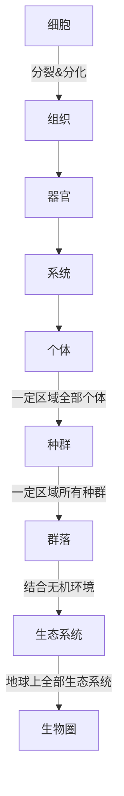

# 生物笔记

## Chapter I 细胞

### 1. 细胞是生命活动的基本单位

细胞学说：

- 细胞是一个 **有机体**，一切动植物都是细胞构成
- 细胞是 **相对独立的单位**，有自己生命，也对其它生命起作用
- 新细胞由老细胞 **分裂** 形成。

- 意义：揭示了动植物的统一性

  > 注意：并没有体现出差异性

生命系统

注意：

- 植物没有 “系统” 这一层。
- 单细胞生物，又是“细胞”，又是 “个体”。
- 分子，原子，病毒，不属于上面任何一层，因为它们不能 **独立** 完成生命活动。

### 2. 细胞多样性和统一性

- 多样性的体现：
- - 真核与原核细胞：真核细胞有 **以核膜为界限的成型细胞核**，而原核细胞没有，只有一个裸露的环形DNA分子构成的 **拟核**。
  - 真核细胞间的差异：植物细胞有液泡，细胞壁，叶绿体等，动物细胞没有
  - 原核细胞间的差异：比如，细菌有各种形状的
- 统一性的体现：
- - 真原核：都有DNA作为遗传物质，细胞质，细胞膜，与核糖体，线粒体等细胞器
  - 真核之间：都有成型细胞核与核膜，以及若干细胞器
  - 原核之间：都有拟核，以及若干细胞器

**常见的真核，原核生物**

- 原核
- - 细菌：杆菌，球菌，弧菌，螺旋菌
  - 蓝细菌：发菜，xxx蓝细菌
  - xxx体（立克次氏体，支原体，衣原体），放线菌
  - 口诀：立刻用蓝细线织毛衣
- 真核
- - 原生生物：衣藻，草履虫，变形虫，黏菌
  - 动植物
  - 真菌：酵母菌，蘑菇，霉菌